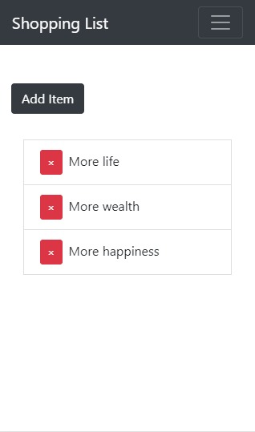

(English)
# Shopping List (MERN stack Web App)
- [Shopping List website]() A responsive application - fits all devices - that allows you to add items for a Shopping List to a cloud database and allows you to delete and retrieve the added items.

## Main purposes

To learn how to connect the MERN stack and perform CRUD operations on a MongoDB Cloud database

To understand the inner parts of the front end such as React, React components and Reactstrap, as well as the inner parts of the back end such as Express wrapper, the node.js server and the routing methods to the database

To apply the concepts of an MVC architecture into a simple yet whole web application

## Installation

git clone this repository to create a website of yours based on my own.

install dependencies listed on both package.json in client and server folders

## Website Design and Development Process

- Mobile version v1.0.0

